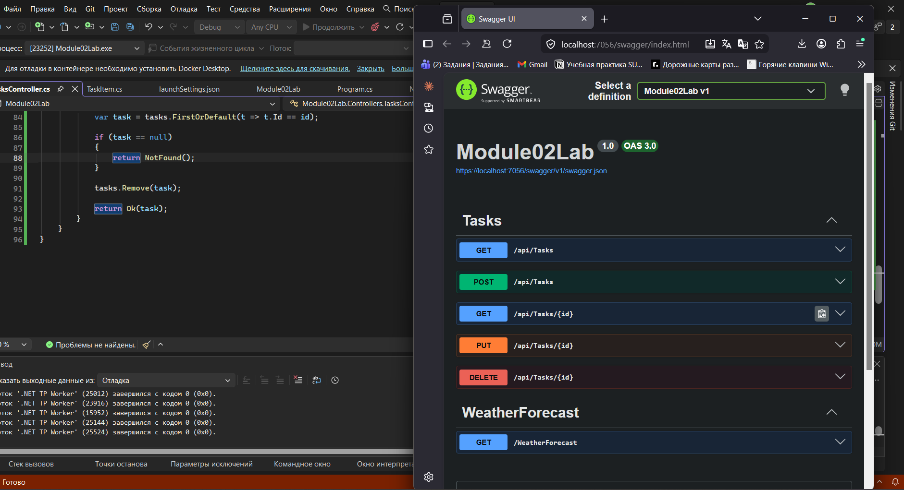
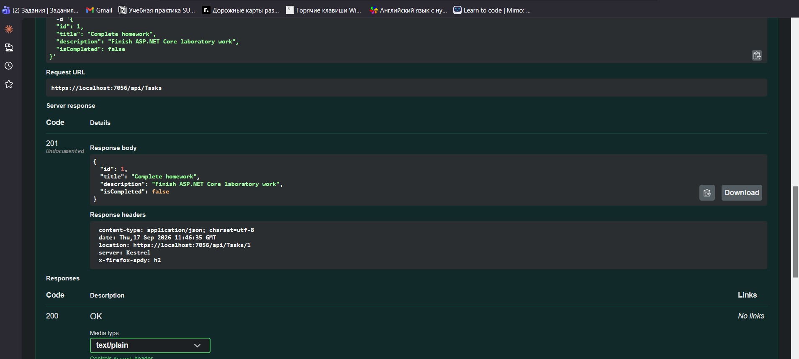
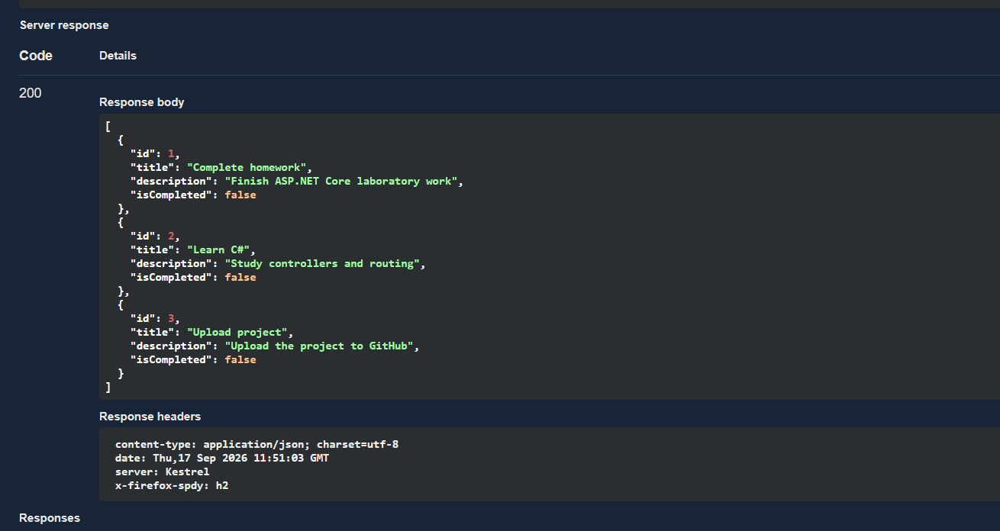
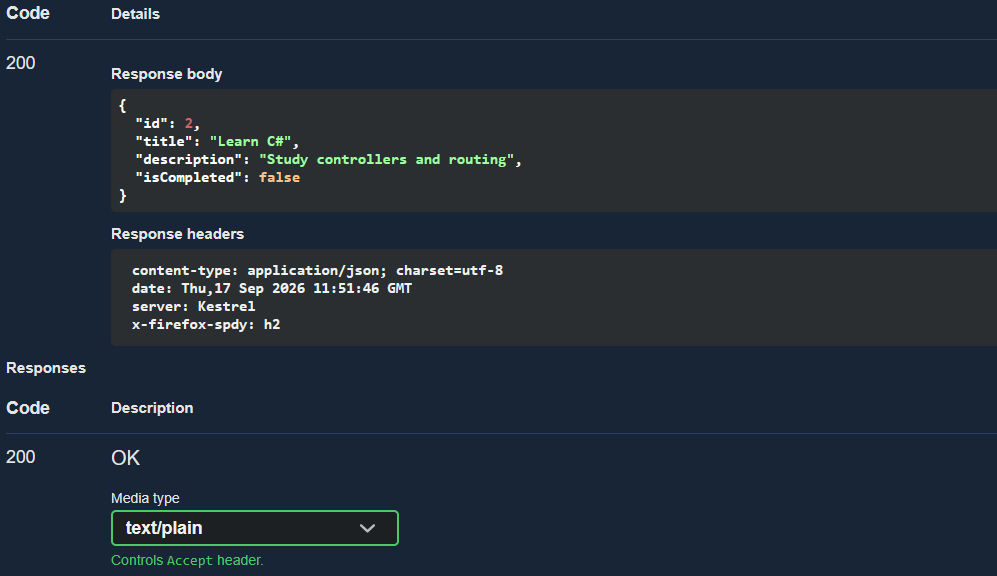
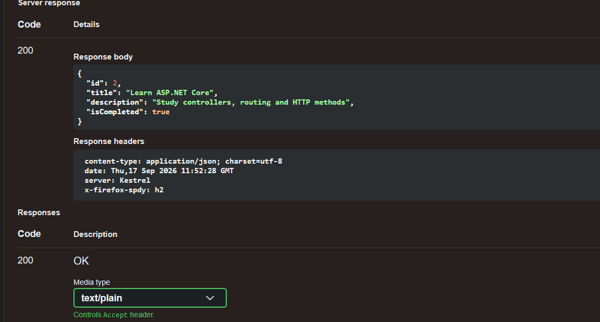
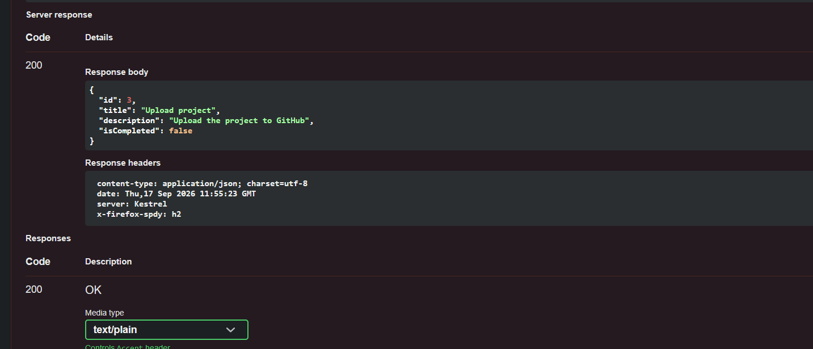
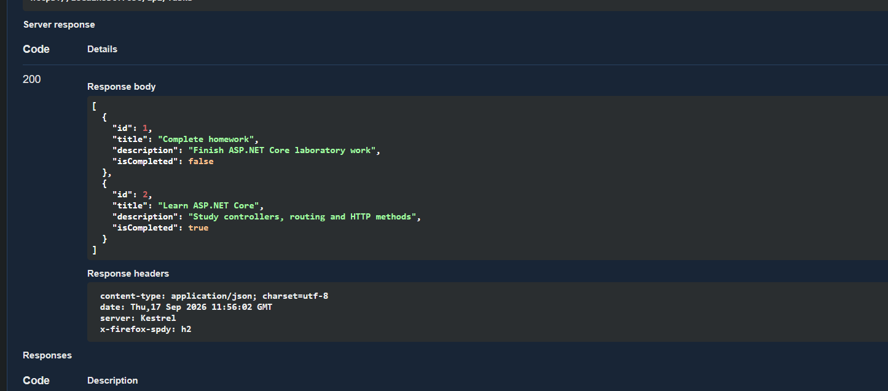

# Модуль 02 лаба

В этой лабораторной работе я разработала REST API на ASP.NET Core для управления списком задач.

Проект сделан на .NET 10. Для тестирования API использовала Swagger.

## Что реализовано

* `GET /api/tasks` - получение всех задач
* `GET /api/tasks/{id}` - получение задачи по Id
* `POST /api/tasks` - добавление новой задачи
* `PUT /api/tasks/{id}` - изменение существующей задачи
* `DELETE /api/tasks/{id}` - удаление задачи

Данные хранятся в `List<TaskItem>`, база данных в этой работе не используется.

## Swagger

После запуска проекта в Swagger отображаются все реализованные методы API.

## POST

Через POST я добавила новые задачи в список.

## GET

Через GET получила список всех добавленных задач.

## GET по Id

Проверила получение одной задачи по её Id.

## PUT

Через PUT изменила название, описание и статус существующей задачи.

## DELETE

Через DELETE удалила одну задачу из списка.

## Результат после изменений

После изменения и удаления задач снова выполнила GET и проверила итоговый список.

## Контрольные вопросы

### 1. Что такое Web API?

Web API - это интерфейс, который позволяет приложениям обмениваться данными через HTTP-запросы.

### 2. Для чего используется [ApiController]?

Атрибут `[ApiController]` указывает, что класс является API-контроллером и помогает автоматически обрабатывать запросы и ошибки валидации.

### 3. Для чего используется [Route]?

Атрибут `[Route]` определяет адрес, по которому доступны методы контроллера. В данном проекте используется `[Route("api/[controller]")]`, поэтому для `TasksController` используется маршрут `/api/tasks`.

### 4. Чем отличаются GET и POST?

GET используется для получения данных, а POST - для создания нового объекта и отправки данных на сервер.

### 5. Чем отличаются PUT и DELETE?

PUT используется для изменения существующего объекта, а DELETE - для его удаления.

### 6. Что означают HTTP-коды?

* `200 OK` - запрос успешно выполнен.
* `201 Created` - новый объект успешно создан.
* `400 Bad Request` - в запросе переданы некорректные данные.
* `404 Not Found` - запрашиваемый объект не найден.

## Итог

В результате я разработала простой REST API, который позволяет создавать, получать, изменять и удалять задачи. Все методы проверила через Swagger.
